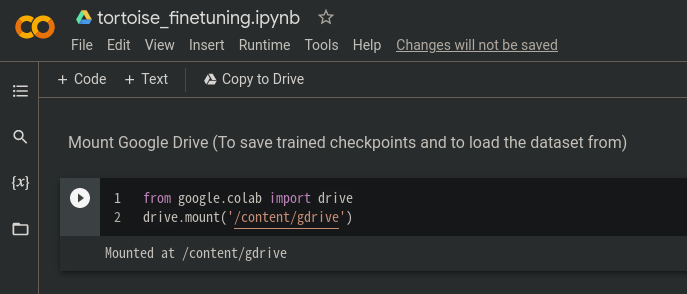
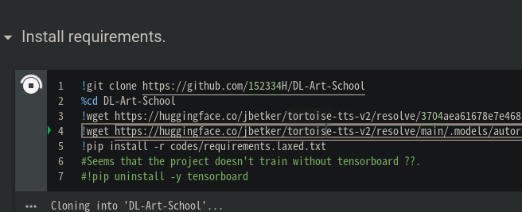
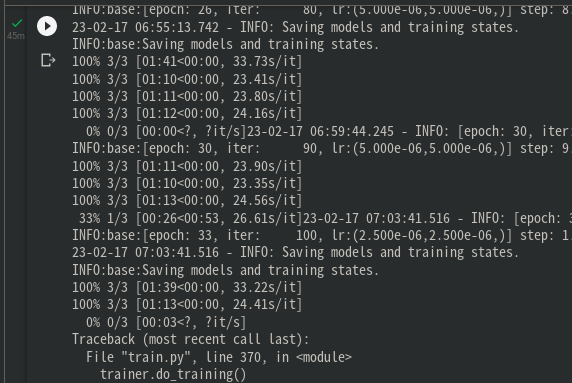
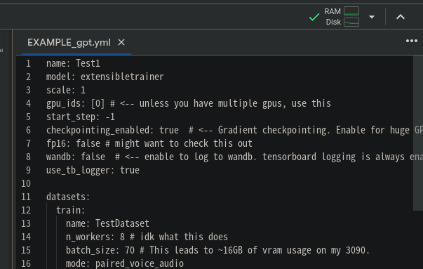

# Fine-tuning TorToiSe's GPT Model with Colab

This is an (experimental) instruction guide to fine-tuning :turtle: on Google Colab. If you experience any errors/difficulties in using the notebook, **report them [here](https://github.com/152334H/DL-Art-School/issues/2)**.

## [Click me](https://colab.research.google.com/drive/1-KmMuexR9Mv40QHNt_If2YY8nx3rFi4a) to visit the colab notebook!

## Before running anything...

You need to prepare an **LJSpeech** formatted dataset to be used with training.

Upload your dataset to a folder on your personal Google Drive.

* If you have a lot of files, you might want to upload a compressed archive and write code to extract it in the notebook (but if you cannot do this, then that's okay, just wait for the upload to finish)

##### If your dataset is &lt;1k files, you might want to wait for a few days until the Colab Notebook is updated to adjust hyperparameters for smaller datasets

## Using the notebook

The top of the colab notebook currently looks something like this:

**Before starting**, check that your runtime type is a **GPU** (`Runtime -> Change runtime type`):

With that settled, click the first play button to start the notebook. You should get a message like this:

* The notebook is **not controlled by me**, and mounts your personal Google Drive folder, so if you are particularly paranoid, you may want to read the code contained in the notebook before running anything.

Once the first cell finishes, you can run the next cell to install DLAS:

This should take less-than 5 minutes to run.

* If you receive an error at this point (or at any point later on), please report the problem.

---

### Everything after this section is likely to change in the future

The next cell to run requires configuration. **Edit the `Dataset_Training_Path` and `ValidationDataset_Training_Path` fields** to match the dataset you uploaded to Google Drive at the start of this tutorial.

* `Dataset_Training_Path` should point to the **full path** of `train.txt`, e.g. `/content/gdrive/MyDrive/mydatasetname/train.txt`, and `ValidationDataset_Training_Path` should point to the same for `val.txt`.
* It is okay if the text files are not exactly named `train.txt` or `val.txt`, but they must be LJSpeech formatted.

Run the config cell. If it works without errors, then you can start training by running the next cell:

The training will take **a long amount of time**, and must be **manually stopped** when you think the results are good enough.

* If the cell stops very quickly (&lt;5mins), something probably went wrong and you should post the logs to discussion/issues.
* If the number of steps per each epoch is &lt;40, the default training config is probably ill suited for your dataset (see the README on dataset size vs hyperparams). For now you will have to manually adjust them; code to automatically adjust params will come soon.
* If you see the printed loss numbers decrease, something has probably gone wrong

Once you are satisfied with the training, **and you have seen an `INFO` log saving checkpoints recently**, click the stop button on the training cell:

And then run the last cell to copy the trained weights/logs to your google drive folder:

Each model checkpoint is **1.6GB**, so there is a high chance that you will run out of storage space if your gdrive is close to full.

### For advanced users only

The full .yml config can be found at `/content/DL-Art-School/experiments/EXAMPLE_gpt.yml`. You may edit it directly by double-clicking on it at the file explorer:

**There should be no need to do this**; this is just an extra note for people who understand the DLAS config files well.

### Using the trained models

go to tortoise-tts-fast and use do_tts.py with the --ar-checkpoint flag
